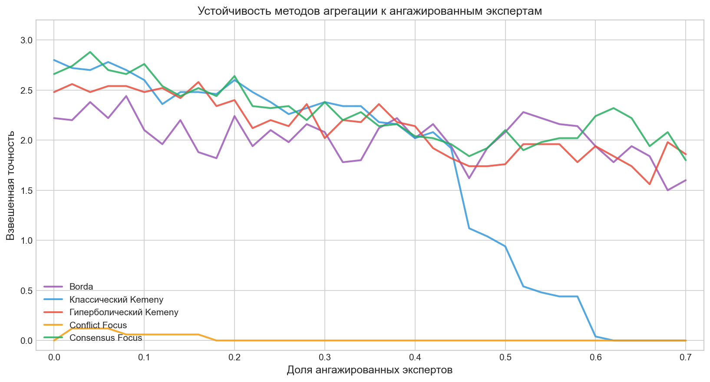

# AggregationRules

Программная реализация методов агрегирования индивидуальных предпочтений на языке Java. Проект основан на учебнике:

> **Петровский А.Б. Теория принятия решений.** — М.: Издательский центр «Академия», 2009. — Глава 21, 22.

## Реализованные методы

### Базовые методы (из учебника)

| Метод | Описание |
|-------|----------|
| **Сумма рангов** (Гудман—Марковиц) | $r_{agg}(A_i) = \sum_{s} g_s \cdot r_i^{(s)}$ |
| **Взвешенная сумма рангов** | $r_{agg}(A_i) = \sum_{s} g_s \cdot w_{r_i}^{(s)}$ |
| **Аддитивная полезность Харшаньи** | $U(A_i) = \sum_{j} \alpha_j \cdot u_{ij}$ |
| **Медиана Кемени** | Минимизация $\sum d_{ik}$ через задачу о назначениях |

### Новый метод: Позиционно-взвешенная медиана Кемени

**Модификация классического метода Кемени** с учётом неравнозначности позиций в ранжировке.

**Идея:** В реальных задачах ошибка на первом месте критичнее, чем на последнем. Например, в выборах важнее правильно определить лидера, чем аутсайдера.

**Формула:**
$$d_{ik} = \sum_{l=1}^{n} g_l \cdot \varphi(k) \cdot |k - r_{il}|$$

где $\varphi(k)$ — весовая функция позиции $k$.

**Реализованные весовые функции:**

| Функция | Формула | Применение |
|---------|---------|------------|
| Uniform | $\varphi(k) = 1$ | Классический Кемени |
| Hyperbolic | $\varphi(k) = 1/k$ | Выборы, рейтинги |
| Linear | $\varphi(k) = (m-k+1)/m$ | Сбалансированный подход |
| Exponential | $\varphi(k) = e^{-0.5(k-1)}$ | Сильный фокус на топе |
| Logarithmic | $\varphi(k) = 1/\log_2(k+1)$ | Плавное убывание |
| Top-K | $\varphi(k) = 1$ если $k \leq K$, иначе $0$ | Только топ-K позиций |

### Адаптивная медиана Кемени

**Идея:** Веса позиций вычисляются автоматически из данных, а не задаются вручную. Используется **энтропия согласованности экспертов** на каждой позиции.

**Мотивация:** Если на позиции k=1 все эксперты согласны (все поставили одну альтернативу), то эта позиция "решена" и не требует большого веса. Если на позиции k=3 мнения расходятся — там конфликт, который нужно разрешить.

**Формула энтропии для позиции k:**
$$H(k) = -\sum_{A_i} p_i \log_2(p_i)$$

где $p_i$ — доля экспертов, поставивших альтернативу $A_i$ на позицию $k$.

**Два режима работы:**

| Режим | Формула веса | Логика |
|-------|--------------|--------|
| CONFLICT_FOCUS | $\varphi(k) = H(k) / H_{max}$ | Больший вес спорным позициям |
| CONSENSUS_FOCUS | $\varphi(k) = 1 - H(k) / H_{max}$ | Больший вес согласованным позициям |

**Преимущество:** Метод самонастраивающийся — не требует экспертного задания весовой функции, адаптируется к структуре данных.

## Структура проекта

```
src/aggregation/
  Main.java                           # точка входа
  PositionWeightedDemo.java           # демо позиционно-взвешенного Кемени
  AdaptiveKemenyDemo.java             # демо адаптивного Кемени
  AggregatorTests.java                # тесты базовых методов
  model/                              # модели данных
    Alternative.java
    Ranking.java
    RankingEntry.java
    PreferenceProfile.java
    WeightMatrix.java
    UtilityVector.java
    UtilityProfile.java
    AggregatedRanking.java
  algorithms/                         # алгоритмы агрегирования
    RankSumAggregator.java
    WeightedRankSumAggregator.java
    UtilityAggregator.java
    ParetoAnalyzer.java               # Парето-анализ датасетов
  kemeny/                             # медиана Кемени
    DistanceMatrix.java
    HungarianSolver.java
    KemenyMedianSolver.java
    KemenyResult.java
    PositionWeightFunction.java       # весовые функции
    WeightedDistanceMatrix.java       # взвешенная матрица
    PositionWeightedKemenySolver.java # позиционно-взвешенный решатель
    PositionWeightedKemenyResult.java
    PositionEntropyAnalyzer.java      # анализ энтропии на позициях
    AdaptiveWeightMode.java           # режимы адаптивного метода
    AdaptiveKemenySolver.java         # адаптивный решатель
    AdaptiveKemenyResult.java
  experiments/                        # эксперименты для статьи
    ExperimentFunctions.java          # сравнение весовых функций
    ExperimentAdaptive.java           # тест адаптивных методов
    ExperimentEntropyMulti.java       # устойчивость к ангажированным экспертам
    ExperimentTiming.java             # замеры времени выполнения
  io/                                 # ввод-вывод
    JsonProfileReader.java
    ProfileDataset.java
    SimpleJsonParser.java

visualization/                        # Python-скрипты для графиков
  plot_entropy.py                     # график устойчивости к манипуляциям
  plot_timing.py                      # график времени выполнения
  requirements.txt                    # зависимости (matplotlib, numpy)

results/                              # результаты экспериментов
  entropy_multi.json                  # данные для графика устойчивости
  timing.json                         # данные для графика времени
  graph_entropy_accuracy.png          # график устойчивости
  graph_timing.png                    # график времени
  functions/                          # результаты ExperimentFunctions
  adaptive/                           # результаты ExperimentAdaptive

architecture.archimate                # ArchiMate диаграммы архитектуры
```

## Датасеты

Проект использует реальные данные из **PrefLib** (Preference Library):

| Файл | Описание | Альтернатив | Голосов | Демонстрирует |
|------|----------|-------------|---------|---------------|
| `skate_conflict.json` | Skating World Junior | 18 | 7 | Conflict Focus меняет победителя |
| `f1_consensus.json` | F1 1976 Season | 13 | 16 | Consensus Focus меняет победителя |
| `f1_hyperbolic.json` | F1 1984 Season | 25 | 6 | Hyperbolic меняет победителя |

### Сгенерированные датасеты

| Файл | Параметры | Описание |
|------|-----------|----------|
| `high_consensus.json` | consensus=0.9 | Все методы дают одинаковый результат |
| `low_consensus.json` | consensus=0.2 | Различия в средних позициях |
| `polarized.json` | clusters=2 | Поляризованные мнения, разные победители |
| `top_consensus.json` | consensus_position=top | Согласие на топе, различия внизу |
| `generated_bottom_consensus.json` | consensus_position=bottom | Споры на топе, меняется победитель |

### Генератор ранжировок

Скрипт `ranking_generator.py` создаёт синтетические датасеты с контролируемыми параметрами:

```bash
# Высокий консенсус
python ranking_generator.py --preset high_consensus --seed 42 -o data/high_consensus.json

# Поляризованные мнения (2 кластера)
python ranking_generator.py --preset polarized --seed 42 -o data/polarized.json

# Согласие на топе
python ranking_generator.py --preset top_consensus --seed 42 -o data/top_consensus.json
```

**Параметры:**
- `--alternatives` — количество альтернатив (по умолчанию 10)
- `--experts` — количество экспертов (по умолчанию 20)
- `--consensus` — уровень согласия от 0 до 1
- `--position` — распределение консенсуса: `uniform`, `top`, `bottom`
- `--clusters` — количество кластеров мнений
- `--seed` — seed для воспроизводимости

### Батч-генерация для экспериментов

```bash
# Серия датасетов для теста устойчивости к ангажированным экспертам
# (30 альтернатив, 100 экспертов, 36 уровней × 100 seeds = 3600 датасетов)
python ranking_generator.py --batch entropy

# Серия датасетов для замера времени выполнения
# (от 10 до 100 000 экспертов)
python ranking_generator.py --batch timing
```

### Конвертер PrefLib

Для конвертации данных PrefLib в JSON используется скрипт `convert_preflib.py`.

**Поддерживаемые форматы PrefLib:** SOC, SOI, TOC, TOI, CAT, WMD.

**Использование:**
```bash
# Конвертация в формат AggregationRules
python convert_preflib.py input.soc
python convert_preflib.py input.toc -o output.json

# Конвертация в формат DASS
python convert_preflib.py input.soc --dass
```

При конвертации в DASS ранжировки преобразуются в числовые оценки: порядок альтернатив становится их рангами (1, 2, 3...), критерий один — "Rank" с типом "negative" (меньше ранг = лучше).

**Пример:**
```bash
python convert_preflib.py 00006-00000021.soc -o data/skate_conflict.json
```

## Эксперименты

### Запуск экспериментов (Java)

```bash
# Сравнение Borda + Classic + 5 весовых функций
java -cp out aggregation.experiments.ExperimentFunctions data/skate_conflict.json

# Тест адаптивных методов (Conflict Focus, Consensus Focus)
java -cp out aggregation.experiments.ExperimentAdaptive data/skate_conflict.json

# Устойчивость к ангажированным экспертам (требует data/entropy/)
java -cp out aggregation.experiments.ExperimentEntropyMulti data/entropy

# Замеры времени выполнения (требует data/timing/)
java -cp out aggregation.experiments.ExperimentTiming data/timing
```

### Визуализация результатов (Python)

```bash
cd visualization

# График устойчивости к ангажированным экспертам
python plot_entropy.py

# График времени выполнения
python plot_timing.py
```

Результаты сохраняются в `results/`:
- `graph_entropy_accuracy.png` — устойчивость методов к манипуляциям
- `graph_timing.png` — зависимость времени от числа экспертов

## Результаты

### Skating (skate_conflict.json) — Conflict Focus

| Метод | 1 место | 2 место |
|-------|---------|---------|
| Classic | Sergei Davydov | Yunfei Li |
| **Conflict Focus** | **Yunfei Li** | Sergei Davydov |

**Вывод:** Conflict Focus меняет победителя! Позиция 1 имеет низкую энтропию (0.235), метод даёт ей низкий вес.

### F1 1976 (f1_consensus.json) — Consensus Focus

| Метод | 1 место | 2 место |
|-------|---------|---------|
| Classic | Hunt | Depailler |
| **Consensus Focus** | **Scheckter** | Hunt |

**Вывод:** Consensus Focus меняет победителя! Фокус на согласованных позициях.

### F1 1984 (f1_hyperbolic.json) — Hyperbolic

| Метод | 1 место | 2 место |
|-------|---------|---------|
| Classic | Prost | Warwick |
| **Hyperbolic** | **Angelis** | Warwick |

**Вывод:** Hyperbolic (φ(k)=1/k) меняет победителя при большом числе альтернатив (25).

### Устойчивость к ангажированным экспертам

Эксперимент моделирует ситуацию, когда часть экспертов координированно продвигает определённые альтернативы (например, голосование с группами поддержки, онлайн-рейтинги с накрутками).



**Ключевые выводы:**
- **Consensus Focus** показывает наилучшую устойчивость — опирается на позиции с высоким согласием экспертов
- **Hyperbolic Kemeny** также демонстрирует высокую устойчивость
- **Classic Kemeny** полностью теряет точность при >45-50% ангажированных
- **Conflict Focus** неприменим в условиях манипуляций (усиливает влияние спорных позиций)

## Формат входных данных

Входные данные задаются в формате JSON:

```json
{
  "metadata": {
    "title": "Example",
    "source": "Textbook"
  },
  "alternatives": ["A", "B", "C"],
  "rankings": [
    {
      "order": ["A", "B", "C"],
      "voters": 23,
      "weights": {"A": 2, "B": 4, "C": 5}
    },
    {
      "order": ["B", "C", "A"],
      "voters": 17,
      "weights": {"A": 6, "B": 1, "C": 3}
    }
  ],
  "utilityProfiles": [
    {
      "id": "Expert-1",
      "weight": 0.5,
      "utilities": {"A": 0.90, "B": 0.70, "C": 0.40}
    }
  ]
}
```

### Описание полей

- `alternatives` — массив имён альтернатив.
- `rankings` — массив ранжировок:
  - `order` — упорядочение альтернатив (первый элемент — лучший);
  - `voters` — число голосов за данную ранжировку;
  - `weights` — (опционально) веса мест для взвешенной суммы.
- `utilityProfiles` — (опционально) массив экспертов для метода Харшаньи:
  - `id` — идентификатор эксперта;
  - `weight` — вес эксперта;
  - `utilities` — значения полезности для каждой альтернативы (от 0 до 1).

Полное описание формата: [`docs/json_format.md`](docs/json_format.md).

## Тестирование

Проект включает тесты для проверки корректности базовых методов:

```bash
java -cp out aggregation.AggregatorTests
```

Каждый тест содержит **ручной расчёт** в комментариях для верификации.

## Требования

- JDK 17 или выше
- Python 3.8+ (для конвертера PrefLib)

Проект не использует внешних зависимостей.

## Сборка и запуск

**Сборка:**
```powershell
$files = (Get-ChildItem -Recurse src -Filter *.java).FullName
javac -d out -sourcepath src $files
```

**Запуск базовых методов:**
```bash
java -cp out aggregation.Main data/profile_example.json
```

**Запуск позиционно-взвешенного Кемени:**
```bash
java -cp out aggregation.PositionWeightedDemo data/f1_hyperbolic.json
```

**Запуск адаптивного Кемени:**
```bash
java -cp out aggregation.AdaptiveKemenyDemo data/skate_conflict.json
```

**Запуск тестов базовых методов:**
```bash
java -cp out aggregation.AggregatorTests
```

## Архитектура

Диаграммы архитектуры системы в формате ArchiMate находятся в файле `architecture.archimate`:
- **Data Processing Pipeline** — пайплайн обработки данных
- **System Architecture** — структура пакетов и классов

## Автор

**Гизатулин Артём Гайнанович** ([@Klagvar](https://github.com/Klagvar))  
Санкт-Петербургский политехнический университет Петра Великого (СПбПУ)

## Лицензия

MIT License — см. файл [LICENSE](LICENSE).
